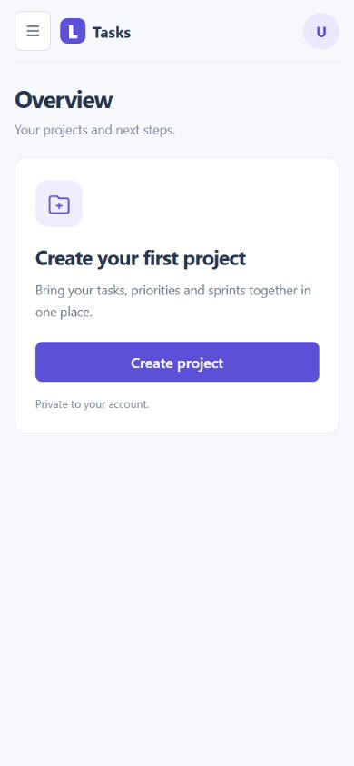
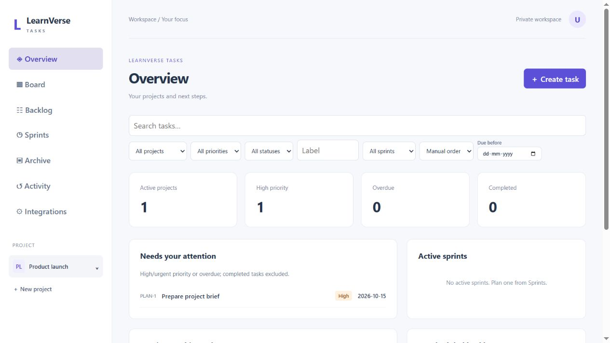

# Mobile workspace layout

The fictional sample button and copy are removed from onboarding. An empty workspace offers **Create project**; an empty project guides its owner to **Create task**. Empty workspaces omit task filters and zero-value summary panels.

Phones use a compact sticky header, account avatar and **Open navigation** menu. The navigation drawer includes the workspace views and searchable project switcher, contains keyboard focus, closes with Escape and restores focus to the menu button. Desktop retains the sidebar.

Search stays visible. **Filters** reveals the remaining controls, shows an active count and offers **Reset filters**. Date fields occupy a full row. Screens up to 360 px use a single column of filters, and phone task forms use one column with 16 px inputs. Project actions wrap within the available width. The board scrolls horizontally within the page; card bodies support touch scrolling, while the grip supports dragging and task details offer **Move to status**.

Build and manual Codex-browser checks passed at 320 and 390 px, including production project/task creation, date filtering/reset, persisted status changes, navigation and board scrolling. Desktop was checked after resetting the viewport. No page overflow or console errors were observed. Native iPhone Safari was not controlled. Existing user workspaces were not modified by QA; isolated test accounts and their small fixtures remain.

Current frontend: `index-CnAWNCvv.js`, `index-D4gJOuOh.css`, `bulk-import-xhCJxRii.js`. Dev and production share these verified assets and the previously tested API ZIP. No infrastructure or permission changes were needed. Refresh the open page to load the new UI.

