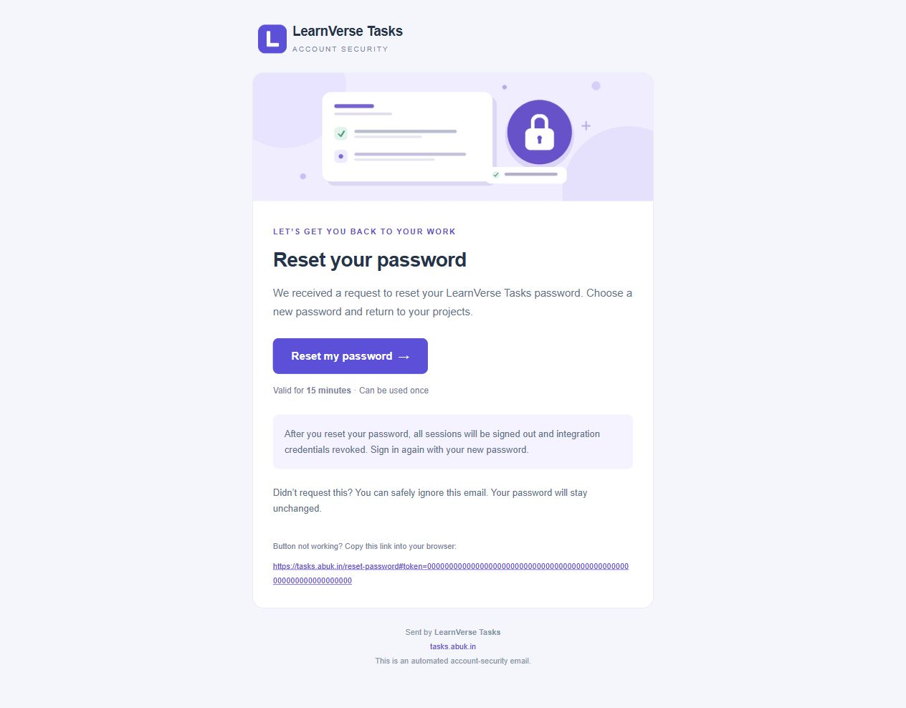

# Password recovery and account settings

Use **Forgot password?** on the sign-in screen. Requests always return the same message for known and unknown emails. Links expire after 15 minutes, work once, and keep their token in the URL fragment so it is not sent in the initial page request. The page removes that fragment immediately. Reset hashes and expiry are stored on the user document; consuming a link and changing the bcrypt password happen atomically.

Each password change increments the account's authentication version. Existing sessions and scoped MCP/REST credentials become invalid immediately, including credentials created by requests that started before the change. Sign in again and explicitly create new integration credentials if needed. The avatar's **Settings** page also supports changing a password after verifying the current password.

Messages show **LearnVerse Tasks** as the sender and use a branded HTML layout with an embedded logo and original task-and-lock illustration, a reset button, expiry instructions and a copyable link. Images are bundled PNG attachments referenced by Content-ID, so the message does not depend on an external image host or tracking URL. A plain-text alternative is included. `server/reset-email-template.ts` defines both versions; `scripts/render-email-art.py` regenerates the artwork and `scripts/preview-reset-email.ts` creates a local preview with an inactive example token.

Production uses the owner's Gmail SMTP account `learnverse02@gmail.com`, with TLS on port 465. Each environment reads its own Standard SecureString SSM JSON parameter, `/learnverse-tasks/dev/smtp` or `/learnverse-tasks/prod/smtp`. The fields are `user` and `password`; the value is never included in CloudFormation, Lambda environment settings, Git, artifacts, diagnostics or deployment records. The Lambda role can read only its matching MongoDB and SMTP parameters.

For local use, configure `RESET_EMAIL_TRANSPORT=smtp`, `RESET_EMAIL_FROM`, `SMTP_HOST`, `SMTP_PORT`, `SMTP_USER` and `SMTP_PASSWORD` in an ignored `.env`. Use an app password for Gmail. The transport requires TLS, validates certificates, and has connection/time limits. If no sender is configured, the endpoint returns a clear unavailable error. Provider failures invalidate the pending reset token and return the same generic response to avoid revealing which addresses have accounts; only a fixed diagnostic without recipients or token values is logged.

Recovery requests share persistent authentication rate limits and have a one-minute account cooldown. Gmail's sending limits still apply. No email verification service, paid email subscription or SES production approval is needed for this configured SMTP transport.

To rotate the owner's existing SMTP app password, update the encrypted parameters through a secure entry flow, then refresh the Lambda configuration so warm instances reload the secret. Never pass credentials as command arguments. `scripts/configure-smtp.py` accepts an explicitly supplied private file, stores the two encrypted parameters and erases that input. The private file must be excluded from Git and deployment archives.

